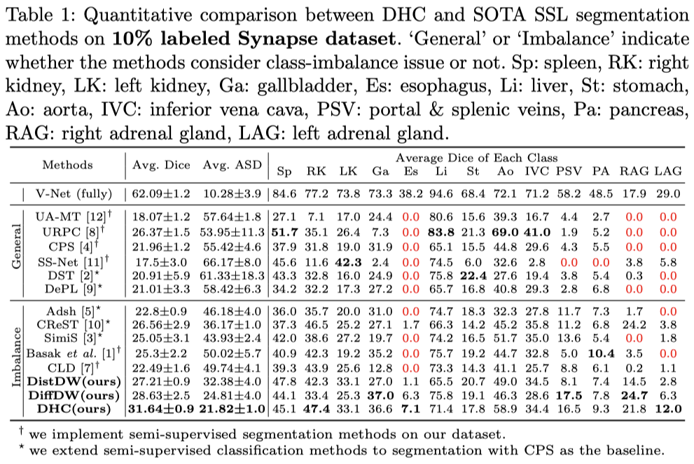
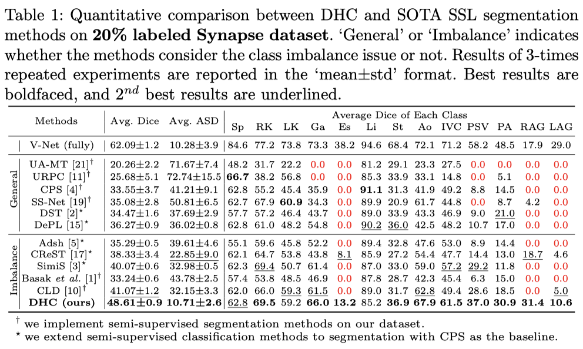
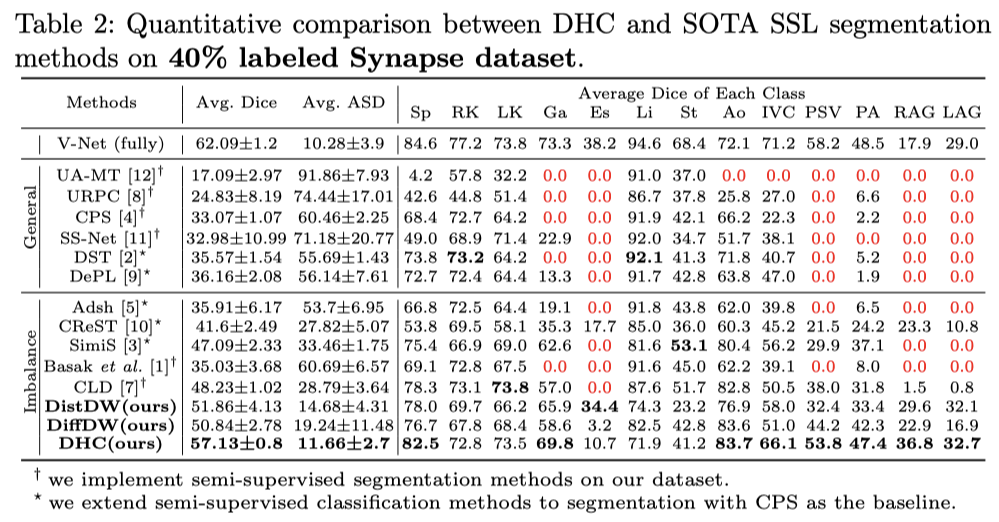
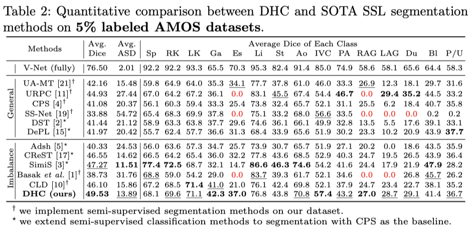

## [MICCAI2023] DHC

This repo is the official implementation of [DHC: Dual-debiased Heterogeneous Co-training Framework for Class-imbalanced Semi-supervised Medical Image Segmentation](https://link.springer.com/chapter/10.1007/978-3-031-43898-1_56) which is accepted at MICCAI-2023.


🚀🚀🚀 We highly recommend you try our new work: https://github.com/xmed-lab/GenericSSL, which considers more practical scenarios of semi-supervised segmentation and the paper is accepted at _**NeurIPS-2023**_!


### 1. Environment

This code has been tested with Python 3.6, PyTorch 1.8, torchvision 0.9.0, and CUDA 11.1 on Ubuntu 20.04.

Before running the code, set the `PYTHONPATH` to `pwd`:
```shell
export PYTHONPATH=$(pwd)/code:$PYTHONPATH
```

### 2. Data Preparation

#### 2.1 Synapse
The MR imaging scans are available at https://www.synapse.org/#!Synapse:syn3193805/wiki/.
Please sign up and download the dataset. 

Put the data in anywhere you want then change the file paths in `config.py`.

Run `./code/data/preprocess.py` to 
- convert `.nii.gz` files into `.npy` for faster loading. 
- generate the train/validation/test splits
- generate the labeled/unlabeled splits 

Or use our pre-split files in `./synapse/splits/*.txt`. 

After preprocessing, the `./synapse_data/` folder should be organized as follows:

```shell
./synapse_data/
├── npy
│   ├── <id>_image.npy
│   ├── <id>_label.npy
├── splits
│   ├── labeled_20p.txt
│   ├── unlabeled_20p.txt
│   ├── train.txt
│   ├── eval.txt
│   ├── test.txt
│   ├── ...
```

#### 2.2 AMOS
The dataset can be downloaded from https://amos22.grand-challenge.org/Dataset/

Run `./code/data/preprocess_amos.py` to pre-process.

### 3. Training & Testing & Evaluating

Run the following commands for training, testing and evaluating.

```shell
bash train3times_seeds_20p.sh -c 0 -t synapse -m dhc -e '' -l 3e-2 -w 0.1
```
`20p` denotes training with 20% labeled data, you can change this to `2p`, `5p`, ... for 2%, 5%, ... labeled data.

Parameters:

`-c`: use which gpu to train

`-t`: task, can be `synapse` or `amos`

`-m`: method, `dhc` is our proposed method, other available methods including:
- cps
- uamt
- urpc
- ssnet
- dst
- depl
- adsh
- crest
- simis
- acisis
- cld

`-e`: name of current experiment

`-l`: learning rate

`-w`: weight of unsupervised loss

**Weights of all the above models trained on 20% labeled Synapse can be downloaded from** [here](https://drive.google.com/drive/folders/1aUU2KvNUVAYLo4qqvT5JBd7hHzo_4K1Q?usp=drive_link).

**Weights of all the above models trained on 5% labeled AMOS can be downloaded from** [here](https://drive.google.com/drive/folders/1mLrM9AswKBiRLu5t63HAtI2ivg17Lt2m?usp=drive_link).


### 4. Results

#### 4.1 Synapse

13 classes: Sp: spleen, RK: right kidney, LK: left kidney, Ga: gallbladder, Es: esophagus, Li: liver, St: stomach, Ao: aorta, IVC: inferior vena cava, PSV: portal & splenic veins, Pa: pancreas, RAG: right adrenal gland, LAG: left adrenal gland.

_4.1.1 Trained with 10% labeled data_


_4.1.2 Trained with 20% labeled data_


_4.1.3 Trained with 40% labeled data_


#### 4.2 AMOS

15 classes: spleen, right kidney, left kidney, gallbladder, esophagus, liver, stomach, aorta, inferior vena cava, pancreas, right adrenal gland, left adrenal gland, duodenum, bladder, prostate/uterus

_4.2.1 Trained with 2% labeled data_


_4.2.2 Trained with 5% labeled data_


_4.2.3 Trained with 10% labeled data_


## Cite
If this code is helpful for your study, please cite:
```
@inproceedings{wang2023dhc,
  title={DHC: Dual-debiased Heterogeneous Co-training Framework for Class-imbalanced Semi-supervised Medical Image Segmentation},
  author={Wang, Haonan and Li, Xiaomeng},
  booktitle={International Conference on Medical Image Computing and Computer-Assisted Intervention},
  pages={582--591},
  year={2023},
  organization={Springer}
}
```

## License

This repository is released under MIT License.

